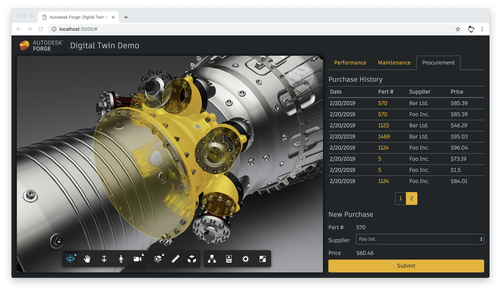

# forge-digital-twin

Autodesk Forge application demonstrating various use cases in manufacturing, specifically in context of digital twins.

## Live demo

Master branch is deployed to https://forge-digital-twin.herokuapp.com.

## Development

### Prerequisites

- Node.js v10+
- Forge app credentials
  - contact @brozp for credentials used in the demo

### Setup

- clone this repository
- install dependencies: `npm install`
- run server: `FORGE_CLIENT_ID=<client-id> FORGE_CLIENT_SECRET=<client-secret> npm start`
- go to http://localhost:3000

### Bootstrap theme

The project uses a custom Bootstrap theme. In order to tweak the theme:

- modify _tools/bootstrap-theme/custom.scss_
- run `npm build:client` to update _public/stylesheets/bootstrap.css_
- commit the new version of the CSS file

### Data storage

The application uses [sequelize](http://docs.sequelizejs.com/) with support for
sqlite and postgres dialects. By default, data is stored locally using sqlite,
in _data/database.sqlite_. If you want to store data in a postgres database,
provide `DATABASE_URL` env. variable in the following form: `postgres://<username>:<password>@<host>:<port>/<dbname>`.
